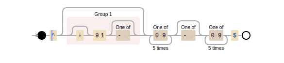
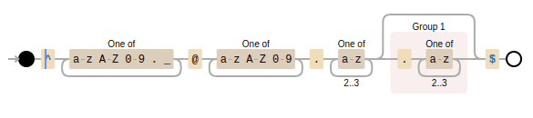

# Basic Regex with Examples

Regex, short for regular expressions, is a powerful tool that can make searching text look magical. You can use it to create patterns or expressions and search for matching text. Let's see some examples below.

### Searching for normal text:

`heymde`

Wait, what? I thought regex was some hackerman junk which normal mortals don't understand! Well, regex is just a pattern, your name is a pattern too. This will only match when it finds the exact same pattern, in this case, which is "heymde".

### Searching for a phone number:

`^(\+?91[- ]?)?[0-9]{5}[- ]?[0-9]{5}$`

`^` marks the beginning of the expression, i.e. it matches the patterns beginning with the given expression, `$` marks the end of it, same as `^` but from the back. `|` is for "OR". The `()` are the same as math ones, `(x + y)m = xm + ym` . So, if you want to choose either Aquaman or Hackerman you'll write `(Aqua|Hacker)man` . Although + is normally used for something else in regex that we will soon learn, but here, we want `+` in the beginning of the string. So, we use an escape sequence, `\+` . We can put the normal text, because we want 91 in front of every phone number. `?` is for optional. It makes the character in front of it optional. `[]` is for characters you wish to match, it will match one of the characters that is present in the square brackets. But what if you want it to match multiple times? For that, we use `{}` . Here, we need the first 5 entries of phone number after 91 (which is optional), and we need those entries to be number, so we did `[0-9]{5}` .

Entries that are valid for given expression-  
`"+91-02342-57823"`  
`"91-02342-57823"`  
`"910234257823"`  
`"0234257823"`

### Searching for an e-mail address:

`^[a-zA-Z0-9._]+@[a-zA-Z0-9]+.[a-z]{2,3}(.[a-z]{2,3})?$`

You probably can figure out basic expressions like `()` or `[]` now. \[a-zA-Z0-9.\_\] means the entry can either be a `.`, `_`, character from `a-z` or `A-Z` . `+` means "one or more", i.e. you can put any amount of those characters, and it will still match. Also, as `+` is for "1 or more", `*` is for "0 or more". We can also set a range of characters that are to be entered by using `{a, b}` where a and b are the given range.

Entries that are valid for given expression-  
`"example@example.co"`  
`"example@example.com"`  
`"example@example.edu.in"`  
`"example@example.edu.inc"`

### Some extra bits:

^\[^whatever\] opposite of what is present inside the square brackets.

For example:  
`^[^a-z]` means it will match any character other than small alphabets.

`\n` any amount of next line  
`\t` tab  
`\d` numbers (whole numbers)  
`\s` space  
`\w` all alphabets  
`.` anything except newline

For practice and learning regex in a visual way, you can try [Debuggex](https://www.debuggex.com/). That's where I learned regex and got all those cool visualizations of regex patterns!

Thank you for reading my blog. Have a nice day!