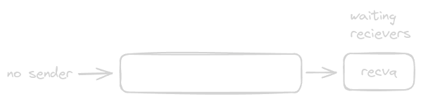
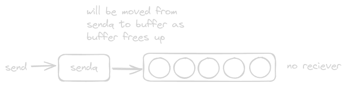

---
image:
    path: assets/images/og_image.png
    width: 300
    height: 169
---

# Channels in Go
Channels are a feature in Go that enable goroutines to communicate and synchronize with each other. They:
- Are Goroutine-safe, i.e. they are safe for concurrent use by multiple goroutines. This is ensured by the use of mutexes, which prevent race conditions when reading from or writing to channels.
- Operate on a FIFO (First In, First Out) basis, ensuring that the order of messages is preserved.
- Can cause goroutines to block or unblock their execution, depending on whether they are buffered or unbuffered and whether the buffer is full or empty.
- Implement the Communicating Sequential Processes (CSP) model by allowing data exchange between goroutines.
- Are publically accessible with `chan`, but are internally implemented as `hchan` struct.

## Creating and Closing Channels
Channels can be created using the `make()` function. They can be either buffered or unbuffered:
```go
// Unbuffered channel
chanUnbuf := make(chan any)

// Buffered channel with a buffer size of 2
chanBuf := make(chan any, 2)
```

Data can be sent to and received from a channel using the `<-` operator:
```go
// Sending data to a buffered channel
chanBuf <- "hello"

// Receiving data from a buffered channel
fmt.Println(<-chanBuf)
```

Closing a channel:
```go
ch := make(chan int, 2)
close(ch)

// This will result in panic
ch <- 10

// This will print 0
fmt.Println(<- ch)
```

## Buffered Channels
Buffered channels have an attached buffer, implemented as a ring buffer or circular queue. When data is sent to a buffered channel, the sending goroutine acquires a lock, copies the data to the channel, and then releases the lock. The receiving goroutine acquires a lock, copies the data from the channel, and then releases the lock. Buffered channels can store data until the buffer is full, allowing the sender to proceed without waiting for a receiver. 



When the buffer is full, the channel behaves like an unbuffered channel. The sender goroutine will block until a receiver is available to receive the data. The channel maintains a queue of send waiters `sendq`, which is a queue of `sudog` struct. Each `sudog` struct stores a reference to the sender goroutine and the data it wants to send. The length of `sendq` can be as long as the number of goroutines that are sending data to the channel.



If the buffer is empty and there are goroutines waiting to receive data, those goroutines will be placed in a queue of receive waiters `recvq`. `recvq` is similar to `sendq`, it is a queue of `sudog` struct. Each `sudog` struct stores a reference to the reciever goroutine and the data it wants to recieve. The receive queue `recvq` will be as long as the number of goroutines waiting to receive data.


the `sudog` struct:
```go
type sudog struct {
    g       *g             // Reference to goroutine
    next    *sudog         // Next sudog in the queue
    prev    *sudog         // Previous sudog in the queue
    elem    unsafe.Pointer // Reference to the data element (for send/receive operations)
    c       *hchan         // Rerefence to channel
    // ...
}
```

If a goroutine cannot send or receive data because the channel is full or empty, respectively, the operation will block. The Go scheduler will set the goroutine to a waiting state with `gopark`. Once the channel can send or receive data, the scheduler sets the goroutine to a runnable state with `goready`.

## Unbuffered Channels
Unbuffered channels, as the name suggests, do not have a buffer. They require both a sender and a receiver to be ready simultaneously for the data to be transferred. 

## Recieve from Multiple Channels
The `select` statement lets a goroutine wait and recieve from multiple channels:
```go
func main() {
    ch1 := make(chan string)
    ch2 := make(chan string)
    
    go func() {
        ch1 <- "from ch1"
    }()
    
    go func() {
        ch2 <- "from ch2"
    }()
    
    // In Go, all execution happens in goroutines.
    // The main function is also executed in a goroutine, which spawns two other goroutines.
    // If the main goroutine terminates, all child goroutines will also be terminated.
    for i := 0; i < 2; i++ {
        select {
        case msg1 := <-ch1:
            fmt.Println(msg1)
        case msg2 := <-ch2:
            fmt.Println(msg2)
        }
    }
}
```

## Iterating Over a Buffered Channel
You can use `for` and `range` to iterate over the data in a buffered channel:
```go
func main() {
    ch := make(chan int, 5)
    
    for i := 0; i < 5; i++ {
        ch <- i
    }
    close(ch)
    
    for val := range ch {
        fmt.Println(val)
    }
}
```

Thankyou for reading my blog.