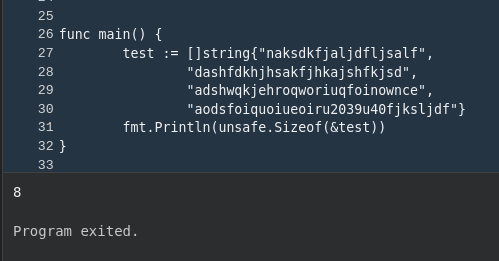

---
image:
    path: assets/images/og_image.png
    width: 300
    height: 169
---

# Pointers in Go
Let's say you wish to pass a list from one function to another. Now, imagine that `[]string` has 1000 10 byte strings. If you were to copy those values to another function with same datatype, i.e. `[]string`, you will be just creating futile additional memory which can easily be avoided.

If you make the second function ask the first function for the memory address of the string, i.e. `*[]string`, it will just give you a 8 byte address by doing `&[]string`, which you can just dereference to access the previously created by `*(&[]string)`, i.e. `*variable`.

Here, size of the array is 24 bytes.

But, size of the address of the array is 8 bytes.

For a long time I thought Go was doing pass by reference, I've realised today, it always does pass by value. 

If I pass memory address of a 6 bit data, it will use 8 byte data. So, passing memory address vs passing data is something that programmer will have to decide by considering what kind of data is being expected. 