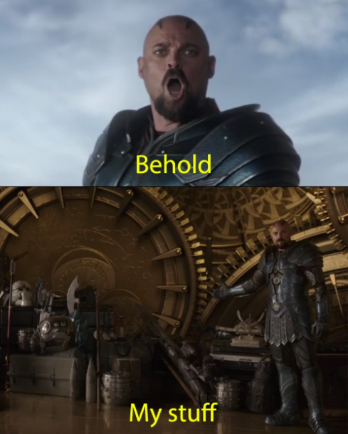

I do some programming in Go and I like doing system administration too. Sometimes I get sad and binge eat my favorite food. Also, I sketch, usually panels from my favorite comics.

    

    

    

        <a href="http://example.com" style="color: white;">Gmail</a> 
        <a href="http://example.com" style="color: white;">LinkedIn</a> 
        <a href="http://example.com" style="color: white;">Twitter</a> 
        <a href="http://example.com" style="color: white;">Instagram</a> 
        <a href="http://example.com" style="color: white;">GitHub</a> 
    

# Blogs

- [Pointers in Go](./ptr-go.html)
- [Food I love](./like-food.html)
- [Multi-stage OCI builds](./multi-stage-oci.html)
- [Basic Regex](./basic-regex.html)
- [OSI Oversimplified](./osi-oversimplified.html)