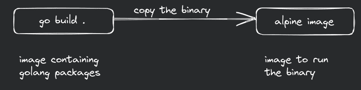

---
image:
    path: assets/images/og_image.png
    width: 500
    height: 500
---

# Multi stage builds of OCI images
One of the main benefits of using container image to ship application is isolation and security. Also, they are meant to be lightweight. But because of size of bigger images like Ubuntu, the image alone easily reaches size greater than 1 GB.

It's not wrong or anything, it's just a bad practice. It will work, as expected, but there are few problems.

1. It will take longer time to push your image to a container registry.
2. Same will happen for when you try to pull it during production, to maybe deploy in your ECS or Kubernetes.
3. More storage requirements.
4. Scalability problems because of limited compute resources.
5. Slower container startup times.
3. Bigger container size, greater attack surface. 

I'm not saying containers from RedHat or Ubuntu will always have vulnerabilities, they go through a lot of testing and QA before they are pushed.

We can reduce the size of the image by removing unused packages. Let's say I needed JDK to compile to bytecode, but I don't need all those tools anymore to just run the java program. I can remove JDK and use JRE. 

There is another way that structures this process in much better way, multi stage builds.



Here, I wish to use my go program in container. But I don't need go package to run go program since it can be compiled to a binary file.

Normal dockerfile (or containerfile)

```dockerfile
FROM docker.io/library/golang:1.20
WORKDIR /usr/src/app
COPY . .
RUN go mod tidy
RUN go build -o backend .
CMD ["./backend"] 
``` 

The cooler dockerfile

```dockerfile
FROM docker.io/library/golang:1.20 AS build-env
RUN apt update && apt install -y musl-tools
WORKDIR /app
COPY . /app
RUN go mod tidy && CC=musl-gcc go build -o backend .

FROM alpine
RUN apk update && apk add ca-certificates && rm -rf /var/cache/apk/*
WORKDIR /app
COPY --from=build-env /app/backend /app
EXPOSE 8081
ENTRYPOINT ./backend
```

In cooler dockerfile, the first stage is used for compiling the source code to a binary file. the second stage is used to run the binary. I'm also installing some other packages which is requirement for the program and removing the package manager's cache because it is not important for binary's execution. Also, I am using Alpine linux image, which is 5 MB compared to Ubuntu's 188 MB. The resulting image size goes from 1.18 GB to just 29.5 MB.

There are lot of other good practices that are written in docker's documentation [here](https://docs.docker.com/develop/develop-images/dockerfile_best-practices/).