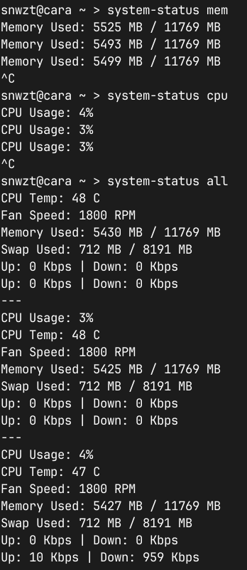

# Quick Project-Based Introduction to Bash Scripting
It is hard to remember bash shell scripting if you try to memorize it. With my horrible memory, that makes it even harder. It is confusing for me to make notes on topics like these too. So, I wrote a script to remember some basic bash scripting I use in general.

This script is a monitoring tool that tells you about your CPU, CPU Temperature, Fan Speed, Memory, Swap, Ethernet, and WiFi speeds.

### Monitoring CPU Usage
I did not want to use built-in tools like top, so I grabbed info from the proc directory:

```bash
cpu_info=($(grep '^cpu ' /proc/stat))

total_cpu_time=$((${cpu_info[1]} + ${cpu_info[2]} + ${cpu_info[3]} + ${cpu_info[4]}))

idle_cpu_time=${cpu_info[4]}

cpu_usage=$((100 - (100 * ($idle_cpu_time - $prev_idle_cpu_time) / ($total_cpu_time - $prev_total_cpu_time))))
echo "CPU Usage: $cpu_usage %"
```

CPU info 1 contains CPU time for normal user mode processes, CPU info 2 contains CPU time for niced user mode processes (niced ones are processes with custom priorities), CPU info 3 is CPU time for kernel mode processes, and CPU info 4 is CPU time spent idle waiting.

### CPU Temperature
I know I could've used lmsensors, but I had my own goals. I use a ThinkPad, so I grabbed data from the proc directory. Also, it checks whether the thinkpad_acpi kernel module is loaded or not to avoid errors.

```bash
if lsmod | grep -q thinkpad_acpi; then
    cpu_temp=$(cat /proc/acpi/ibm/thermal | grep 'temperatures' | awk '{print $2 " C"}')
    echo "CPU Temp: $cpu_temp"
else
    echo "CPU Temp: NA, thinkpad_acpi module not loaded"
fi
```

### Fan Speed
This function monitors the CPU fan speed on a ThinkPad by reading data from the proc directory and checks if the thinkpad_acpi kernel module is loaded to avoid errors.

```bash
if lsmod | grep -q thinkpad_acpi; then
    fan_speed=$(cat /proc/acpi/ibm/fan | awk '/^speed/ {print $2 " RPM"}')
    echo "Fan Speed: $fan_speed"
else
    echo "Fan Speed: NA, thinkpad_acpi module not loaded"
fi
```

### Monitoring RAM Usage
This function grabs memory usage information from the proc directory, calculates the total and available memory, and then converts it into MB for readability.

```bash
mem_total=$(grep '^MemTotal:' /proc/meminfo | awk '{print $2}')
mem_free=$(grep '^MemAvailable:' /proc/meminfo | awk '{print $2}')

mem_total_mb=$((mem_total / 1024))
mem_used_mb=$(( (mem_total - mem_free) / 1024 ))

echo "Memory Used: $mem_used_mb MB / $mem_total_mb MB"
```

### Monitoring Swap Usage
This function checks the swap usage by reading data from the proc directory, calculating the total and free swap memory, and then converting it into MB for readability.

```bash
swap_total=$(grep '^SwapTotal:' /proc/meminfo | awk '{print $2}')
swap_free=$(grep '^SwapFree:' /proc/meminfo | awk '{print $2}')

swap_total_mb=$((swap_total / 1024))
swap_used_mb=$(( (swap_total - swap_free) / 1024 ))

echo "Swap Used: $swap_used_mb MB / $swap_total_mb MB"
```

### Ethernet Speed
This function monitors Ethernet usage by checking the byte count from the sys directory. It calculates the difference between the current and previous byte counts to determine the speed, then converts it to Mbps or Kbps for readability.

```bash
prev_rx_bytes_eth=$(cat /sys/class/net/enp2s0/statistics/rx_bytes)
prev_tx_bytes_eth=$(cat /sys/class/net/enp2s0/statistics/tx_bytes)

get_ethernet_stats() {
    rx_bytes_eth=$(cat /sys/class/net/enp2s0/statistics/rx_bytes)
    tx_bytes_eth=$(cat /sys/class/net/enp2s0/statistics/tx_bytes)
    
    diff_rx=$((rx_bytes_eth - prev_rx_bytes_eth))
    diff_tx=$((tx_bytes_eth - prev_tx_bytes_eth))
    
    prev_rx_bytes_eth=$rx_bytes_eth
    prev_tx_bytes_eth=$tx_bytes_eth
    
    if [[ $diff_rx -gt 1000000 ]]; then
        rx_speed=$((diff_rx / 1000000))
        rx_unit="Mbps"
    else
        rx_speed=$((diff_rx / 1000))
        rx_unit="Kbps"
    fi
    
    if [[ $diff_tx -gt 1000000 ]]; then
        tx_speed=$((diff_tx / 1000000))
        tx_unit="Mbps"
    else
        tx_speed=$((diff_tx / 1000))
        tx_unit="Kbps"
    fi
    
    echo "Up: $tx_speed $tx_unit | Down: $rx_speed $rx_unit"
}
```

### WiFi Speed
This function monitors WiFi usage similarly to Ethernet, by checking the byte count from the sys directory. It calculates the difference between the current and previous byte counts to determine the speed, then converts it to Mbps or Kbps for readability.

```bash
prev_rx_bytes_wifi=$(cat /sys/class/net/wlp3s0/statistics/rx_bytes)
prev_tx_bytes_wifi=$(cat /sys/class/net/wlp3s0/statistics/tx_bytes)

get_wifi_stats() {
    rx_bytes_wifi=$(cat /sys/class/net/wlp3s0/statistics/rx_bytes)
    tx_bytes_wifi=$(cat /sys/class/net/wlp3s0/statistics/tx_bytes)
    
    diff_rx=$((rx_bytes_wifi - prev_rx_bytes_wifi))
    diff_tx=$((tx_bytes_wifi - prev_tx_bytes_wifi))
    
    prev_rx_bytes_wifi=$rx_bytes_wifi
    prev_tx_bytes_wifi=$tx_bytes_wifi
    
    if [[ $diff_rx -gt 1000000 ]]; then
        rx_speed=$((diff_rx / 1000000))
        rx_unit="Mbps"
    else
        rx_speed=$((diff_rx / 1000))
        rx_unit="Kbps"
    fi
    
    if [[ $diff_tx -gt 1000000 ]]; then
        tx_speed=$((diff_tx / 1000000))
        tx_unit="Mbps"
    else
        tx_speed=$((diff_tx / 1000))
        tx_unit="Kbps"
    fi
    
    echo "Up: $tx_speed $tx_unit | Down: $rx_speed $rx_unit"
}
```

### Using the script
You can check out the complete script [here](https://github.com/snwzt/cringe-ahh-scripts/blob/main/system-status).

```bash
Usage: system-status [option]
Options:
  cpu       Display CPU usage
  temp      Display CPU temperature
  fan       Display CPU fan speed
  mem       Display Memory usage
  swap      Display Swap usage
  eth       Display Ethernet usage
  wifi      Display Wifi usage
  all       Display all information
```



## Extras
1. You should write a bash script with `set -eux`. `-e` disallows the script to execute further if one of the statements in the script fails. `-u` treats unset variables as errors and exits. `-x` prints each command before executing it to stdout.
2. There is a difference in POSIX-compliant syntax and bash extensions of it, e.g. while writing an `if` condition, if you use `[ condition ]`, you are using POSIX-compliant syntax. But with bash extensions `[[ condition ]]`, you can do pattern matching `==`, regex `=~`, logical operations `&& ||`, etc.
3. If you don't want your script to be executed as root, check `$EUID`, i.e., effective user ID. If it is 0, prevent the script from executing further. Running a script as `sudo` from a user who is part of the wheel group sets the user ID to 0, which gives administrator privileges to the user. You can check this by executing `id -u` and then `sudo id -u`.
4. You can check the exit status of the previously executed program with `$?`.